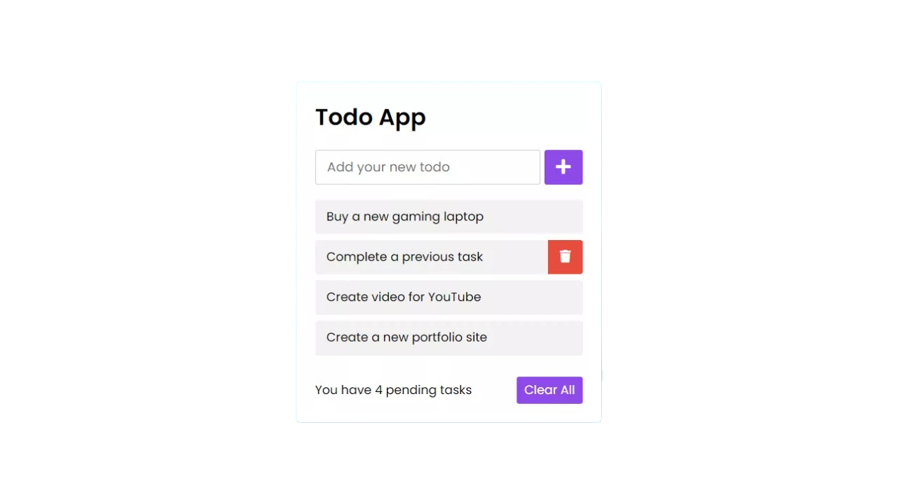
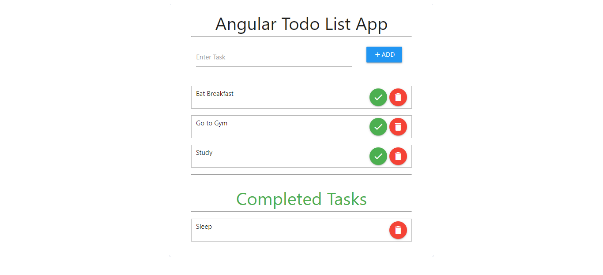
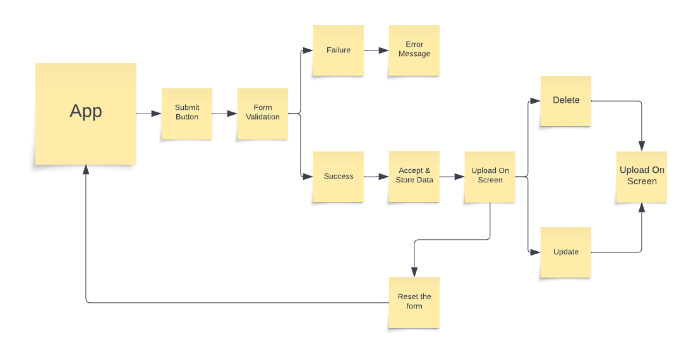
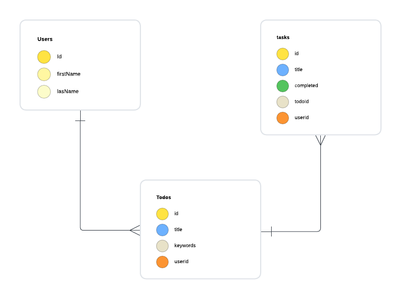

# Overview

A simple ToDo app built using Node.js and Express. This app allows users to manage their tasks by performing CRUD operations (Create, Read, Update, Delete).

## User Stories
#### As a user, I want the ability to...

- create an account
- manage own account
- Create new tasks
- View the list of tasks
- Update task status (complete/incomplete)
- Edit task details
- Delete tasks

## technologies Used
- Node.js
- Express
- MongoDB
- EJS(Embedded JavaScript) for templates

## wireframes

## ERD

## Future Enhancements 
##### (if time is available)
- User authentication to allow multiple users to manage their tasks.
- Task categories and tags.
- Due date for tasks.
- Prioritizing tasks.

## Author 
- Carlos Prieto
- https://github.com/Carlosdos818